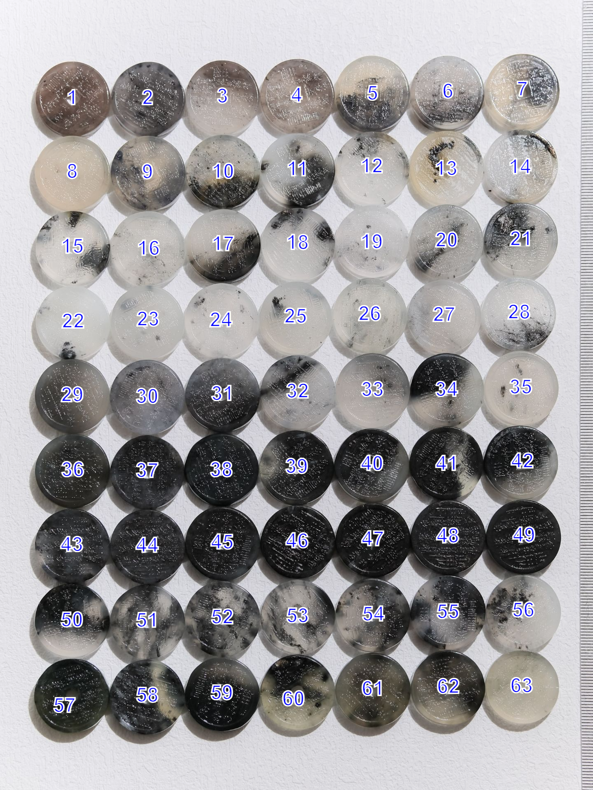

# Automated Round Jade Numbering

## Features
- **Automatic Numbering:** Automatically assigns numbers to each round jade.
- **Jade Detection:** Capable of auto-detecting jades. Allows for manual adjustments in cases of mismatches.
- **Flexible Arrangement:** Provides the ability to modify the number of jades per row to enhance matching accuracy.

